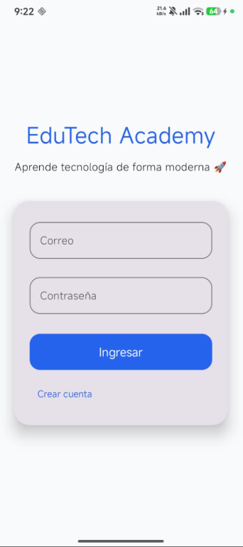
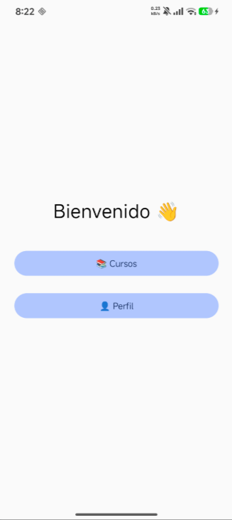
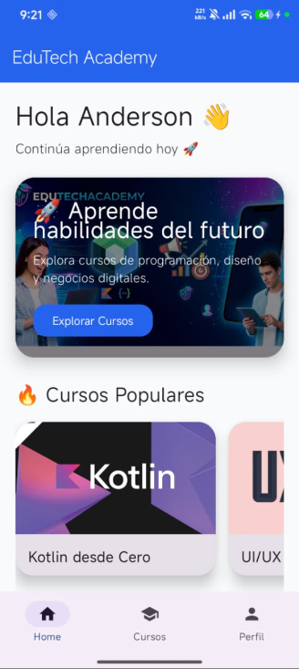
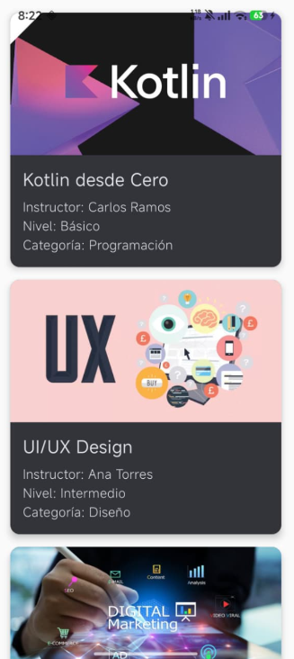
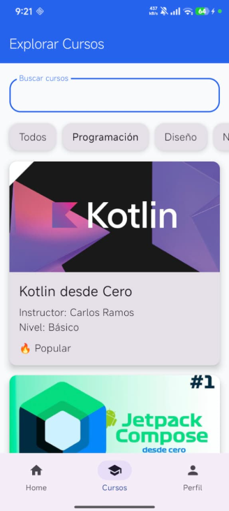
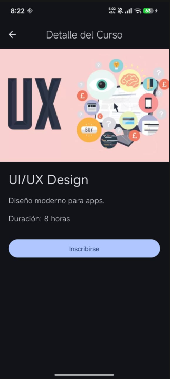
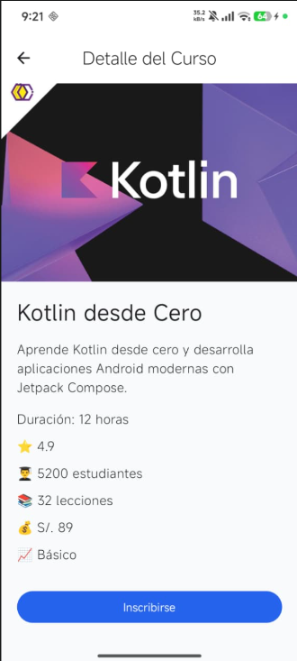
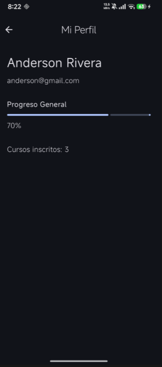
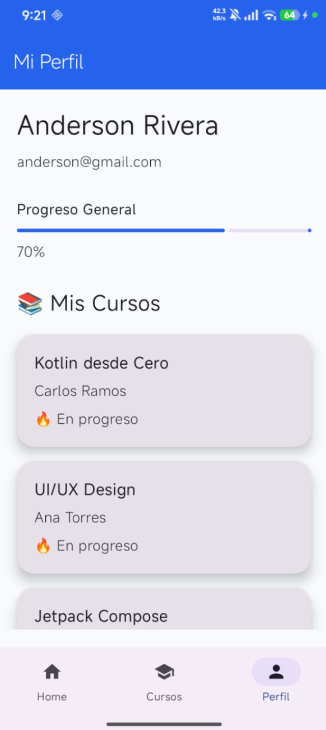

# MEJORAS CON GEMINI - EDUTECH ACADEMY

---

## Prompt usado en Gemini (simulado)

Actúa como un Senior Android Developer experto en Jetpack Compose.
Analiza una app educativa llamada EduTech Academy y mejora su UI/UX.

Requisitos:

- Implementar Bottom Navigation Bar moderno
- Mejorar Home como dashboard real tipo app educativa
- Agregar banner principal con información destacada
- Mejorar pantalla de cursos con buscador y filtros por categoría
- Mejorar tarjetas con sombras, bordes redondeados y jerarquía visual
- Mejorar pantalla de detalle mostrando información completa del curso
- Mejorar perfil mostrando cursos inscritos y progreso visual
- Aplicar Material 3 con paleta moderna
- Mantener navegación con NavHost y NavController
- Mantener estructura original del proyecto

---

## Capturas Antes vs Después

---

### 🔴 LOGIN

## Antes

## Después

---

### 🔴 HOME

## Antes

## Después

---

### 🔴 CURSOS

## Antes

## Después

---

### 🔴 DETALLE DE CURSO

## Antes

## Después

---

### 🔴 PERFIL

## Antes

## Después

---

## Mejoras aplicadas

- Bottom Navigation Bar funcional
- Dashboard tipo app real en Home
- Banner informativo en pantalla principal
- Buscador + filtros en Cursos
- Cards con sombras y mejor jerarquía visual
- Pantallas más ordenadas y responsivas
- Flujo de navegación completo con NavHost

---

## Reflexión

La integración de mejoras permitió transformar una interfaz básica en una aplicación con apariencia profesional,se mejoró la experiencia de usuario mediante jerarquía visual, navegación intuitiva y diseño moderno inspirado en apps educativas reales.
